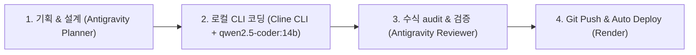

# 📌 PROJECT.md - 초보자를 위한 연금 나침반 (Pension Helper)

이 파일은 새로운 세션이 시작될 때 프로젝트 설정, 워크플로우, 로컬 LLM 연동 방식 및 개발 환경을 복원하기 위한 컨텍스트 정의 문서입니다.
**필수 운용 수칙**: 본 프로젝트의 모든 코딩 작업은 [rules.md](file:///C:/Users/gosys/orca/my_pension_helper/rules.md) 규정에 따라 사용자 PC 로컬 `cline` CLI (`qwen2.5-coder:14b`)를 필수 운용하여 이행합니다.

---

## 1. 프로젝트 개요 (Project Overview)
* **프로젝트명**: 초보자를 위한 연금 나침반 (My Pension Helper)
* **작업 디렉터리**: `C:\Users\gosys\orca\my_pension_helper`
* **GitHub 리포지토리**: `https://github.com/Younseob/my_pension_helper.git` (main 브랜치)
* **배포 URL (Render)**: `https://my-pension-helper.onrender.com`
* **핵심 기능**:
  * 초기 1억 원 일시 투자 (또는 월 적립금 추가)
  * 자산 배분: S&P 500 (70%) + NASDAQ 100 (30%)
  * 15년 스노우볼 거치 적립
  * 16년차 이후 4% 룰(Trinity Study) 기반 원금 보존형 연금 인출 시뮬레이션
  * 역사적 3대 시나리오 (보수적 7.0%, 평균적 11.0%, 희망적 13.8%) 비교 및 동적 Chart.js 타임라인 시각화
  * 원하는 월 연금 수령액 기준 필요 자산 역산 계산기 및 30년 스케줄 CSV 내보내기

---

## 2. 역할 분담 및 에이전트 워크플로우 (Agent Workflow Protocol)



### 롤 정의 (Roles):
1. **[Planner & Reviewer] Antigravity**:
   - 기획(Specification), 수학적 수식 검증(Financial Math Audit), 로컬 CLI 실행 제어, TypeScript 타입 검사(`tsc`), 빌드 및 배포 상태 검증.
2. **[Local Coder] Cline CLI (qwen2.5-coder:14b)**:
   - 온라인 토큰 절감을 위해 사용자 PC의 로컬 Ollama 모델(`qwen2.5-coder:14b`)을 기반으로 파일 작성 및 코드 수정 전담.

---

## 3. 로컬 LLM & Cline CLI 실행 가이드 (Local LLM Execution)

### 로컬 환경 사양:
- **Ollama 경로**: `C:\Users\gosys\AppData\Local\Programs\Ollama\ollama.exe`
- **사용 모델**: `qwen2.5-coder:14b` (Ollama 로컬 탑재)
- **Cline CLI 경로**: `C:\Users\gosys\AppData\Roaming\npm\cline.cmd`

### 코딩 작업 이관 명령 (Cline CLI Command):
코딩 및 파일 수정 작업을 진행할 때는 반드시 `--auto-approve true` 및 로컬 Ollama 옵션을 적용하여 실행합니다.

```bash
cline --auto-approve true -P ollama -m qwen2.5-coder:14b "<코딩 요청 프롬프트>"
```

---

## 4. 기술 스택 및 빌드/구동 명령어 (Tech Stack & Commands)

### 기술 스택 (Tech Stack):
- **Core**: React 19 + TypeScript (`.tsx`) + Vite 6
- **Styling**: Tailwind CSS v3 + Pretendard 폰트 + Dark Theme (`#0F172A` Slate Navy)
- **Charts & Icons**: Chart.js 4 + Lucide React
- **Build Output**: Static Single Page Application (`dist/`)

### 빌드 및 검증 명령어:
- **로컬 개발 서버 구동**:
  ```bash
  cmd /c "npm run dev"
  ```
  *(기본 포트: `http://localhost:5173`)*

- **TypeScript 타입 검사 & 빌드 테스트**:
  ```bash
  cmd /c "npx tsc --noEmit && npm run build"
  ```

- **Git 커밋 & 푸시 (Render 자동 배포 트리거)**:
  ```bash
  cmd /c "git add . && git commit -m \"commit message\" && git push origin main"
  ```

---

## 5. 핵심 코드 및 디렉터리 구조 (Directory Layout)

```
C:\Users\gosys\orca\my_pension_helper
├── PROJECT.md                      # 프로젝트 컨텍스트 정의 문서 (본 파일)
├── index.html                      # HTML 엔트리 포인터 (/src/main.tsx 연결)
├── package.json                    # 프로젝트 의존성 설정
├── vite.config.js                  # Vite 및 preview.allowedHosts 설정
├── tailwind.config.js              # Tailwind 테마 및 컬러 설정
├── tsconfig.json                   # TypeScript 환경 설정
└── src/
    ├── main.tsx                    # React Root 및 ErrorBoundary 포장
    ├── App.tsx                     # 메인 애플리케이션 상태 및 레이아웃
    ├── index.css                   # Tailwind 스타일 및 커스텀 스크롤바
    ├── types/
    │   └── pension.ts              # PensionParams, PresetScenario 등 TS 인터페이스
    ├── utils/
    │   └── pensionMath.ts          # 복리 적립(15년) 및 4% 룰 인출 계산 수학 유틸
    └── components/
        ├── Header.tsx              # 상단 브랜드 헤더 및 모달 버튼
        ├── HeroBanner.tsx          # 핵심 컨셉 요약 및 KPI 카드
        ├── ScenarioCards.tsx       # 3대 역사적 수익률 시나리오 카드
        ├── SimulationChart.tsx     # 30년 동적 Chart.js 타임라인 그래프
        ├── CustomCalculator.tsx    # 슬라이더 기반 커스텀 연금 계산기
        ├── TargetReverseCalculator.tsx # 목표 월 연금액 역산 모달 계산기
        ├── EducationalGuide.tsx    # S&P500, 나스닥, 4% 룰 초보자 안내 모달
        ├── YearlyScheduleTable.tsx # 30년 연도별 상세표 및 CSV 다운로드
        └── Footer.tsx              # 하단 푸터
```
