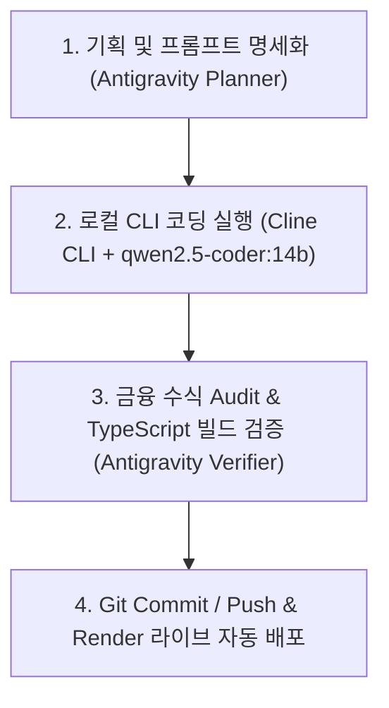

# 📜 RULES.md - 프로젝트 필수 준수 규칙 (Mandatory Local Agent Rules)

이 파일은 본 프로젝트(`my_pension_helper`)의 코딩 및 개발 작업 시 반드시 이행해야 하는 에이전트 운용 수칙을 정의합니다.

---

## 🚨 제1조 (로컬 에이전트 필수 운용 원칙)
1. **온라인 토큰 절감**: 본 프로젝트의 모든 소스코드 신규 작성, 리팩토링, 버그 수정 및 파일 변경 작업은 온라인 API 토큰을 소비하지 않고, **사용자 PC 로컬 환경의 Ollama LLM (`qwen2.5-coder:14b`) 및 `cline` CLI를 통해 이행하는 것을 필수 원칙**으로 한다.
2. **단독 코드 작성 금지**: 플래너 에이전트(Antigravity)가 로컬 CLI 구동 절차 없이 임의로 소스코드를 직접 작성하는 행위를 금지하며, 반드시 로컬 `cline` CLI 실행 파이프라인을 거쳐야 한다.

---

## ⚙️ 제2조 (로컬 Cline CLI 실행 프로토콜)
1. **실행 환경 사양**:
   - **Ollama 서비스**: `http://localhost:11434` (`qwen2.5-coder:14b` 8.37GB 탑재)
   - **Cline CLI 경로**: `C:\Users\gosys\AppData\Roaming\npm\cline.cmd`
2. **터미널 이관 명령어 템플릿**:
   ```bash
   cline --auto-approve true -P ollama -m qwen2.5-coder:14b "<상세 코딩 명세 프롬프트>"
   ```
3. **자동 승인 옵션**: 로컬 에이전트 실행 시 `--auto-approve true` 옵션을 필수로 포함하여 터미널 파일 입출력을 자율 승인으로 처리한다.

---

## 🔄 제3조 (4단계 자율 개발 & 검증 파이프라인)



1. **[Step 1] 기획 & 명세화 (Antigravity Planner)**:
   - 개발할 기능의 금융 수학적 산식, UI/UX 사양 및 로컬 CLI에 전달할 명확한 프롬프트를 설계한다.
2. **[Step 2] 로컬 코딩 수행 (Cline CLI + qwen2.5-coder:14b)**:
   - 로컬 `cline` CLI 명령어로 사용자 PC의 `qwen2.5-coder:14b` 모델에 작업을 이관하고 소스코드를 작성 및 수정한다.
3. **[Step 3] 검증 & Audit (Antigravity Verifier)**:
   - 작성된 코드의 금융 산식을 검증하고 `npx tsc --noEmit` (타입 검사 0 에러) 및 `npm run build` (프로덕션 빌드)를 수행한다.
4. **[Step 4] Git 반영 & 자동 배포**:
   - Git repository에 커밋 및 푸시하여 Render 라이브 사이트에 자동 반영한다.

---

## 📌 제4조 (상태 보존 및 영속성 규칙)
1. **DOM 상주 유지**: 탭 이동 시 사용자가 조절한 슬라이더, 입력값, 시나리오 선택 상태가 초기화되지 않도록 DOM 컴포넌트 언마운트 대신 CSS `block / hidden` 스타일 표시 방식을 고수한다.
2. **상태 동기화**: 포트폴리오 비중(S&P 500 : 나스닥 100) 변경 시 모든 시나리오 카드, 30년 시뮬레이션 그래프, 수치표가 실시간으로 재계산되도록 동적 CAGR 산식을 유지한다.
